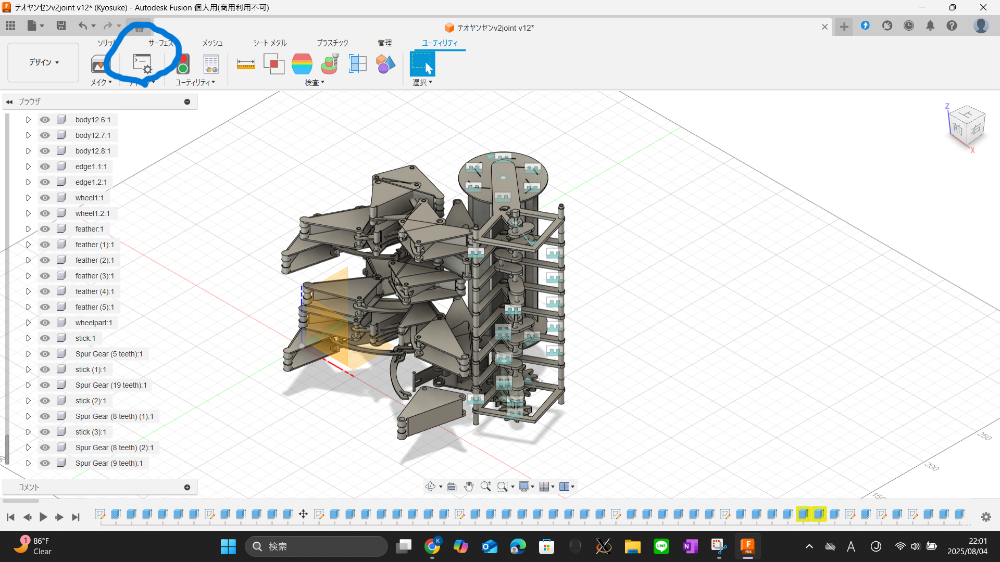
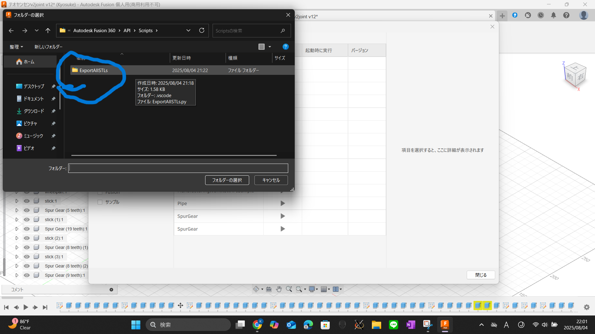

# Export All Components as STL – Fusion 360 Script

> 🇯🇵 日本語版はこちら → [README_ja.md](./README_ja.md)

This is a Python script for Autodesk Fusion 360 that exports **all components in the active design** as individual `.stl` files.

> 💡 I created this add-in because I had **124 components** in my project and manually exporting each one as an STL was extremely tedious.  
> This script automates the process and is especially helpful for robotics, mechanical systems, or any design with many printable parts.

---

## ✅ Features

- Exports **all components and subcomponents** (via occurrences)
- Saves each component as a separate `.stl` file using its name
- Compatible with **Fusion 360’s design workspace**
- Easy to customize for different file types or formats
- Clean Python using the official **Fusion 360 API**

---

## 📁 File Structure

```plaintext
fusion360-export-all-stl/
├── ExportAllSTLs.py      ← Main script
├── README.md             ← English documentation
├── README_ja.md          ← Japanese documentation
└── LICENSE               ← MIT License
```

---

## 🚀 How to Use in Fusion 360

### 1. Open Fusion 360

Make sure your project is open in the **Design workspace**.

### 2. Open the Scripts and Add-Ins Panel

Click `UTILITIES` > `Add-Ins` > `Scripts and Add-Ins`  


### 3. Add a New Script

Click the **"+" button** at the top  
Select **“Add from my computer”**  
Choose the folder containing this script (`ExportAllSTLs`)  


### 4. Run the Script

Find `ExportAllSTLs` in the list and click the **▶︎ Run button**  
Fusion will begin exporting all components as STL files to the chosen directory.  


---

## ⚙️ How It Works

- The script accesses the current `Design` object.
- It traverses all `Occurrences` (i.e. all visible component instances).
- Each occurrence’s `component` is exported as an `.stl` file.
- The output folder is selected by the user via a dialog box.

---

## 🛠 Requirements

- Autodesk Fusion 360 installed
- Python (bundled within Fusion 360 API environment)
- This script works entirely **inside Fusion 360**, no external tools required

---

## 📄 License

This project is licensed under the [MIT License](LICENSE).

---

## 🙋‍♂️ Contributing

Feel free to fork this repo and improve the script — for example:

- Exporting in other formats (STEP, IGES, etc.)
- Filtering components
- Including timeline-based naming

Pull requests are welcome!

---

## ⭐️ Why Use This Script?

If you've ever had to export dozens or even hundreds of STL files from Fusion 360 manually, you know how painful that is.  
This script turns that chore into a single click.  
Built to save time, reduce errors, and support rapid prototyping.

---


## 📬 Contact

If you found this useful, feel free to star the repository or share it with others.  
You can also reach out via GitHub Issues if you run into any problems or suggestions.
