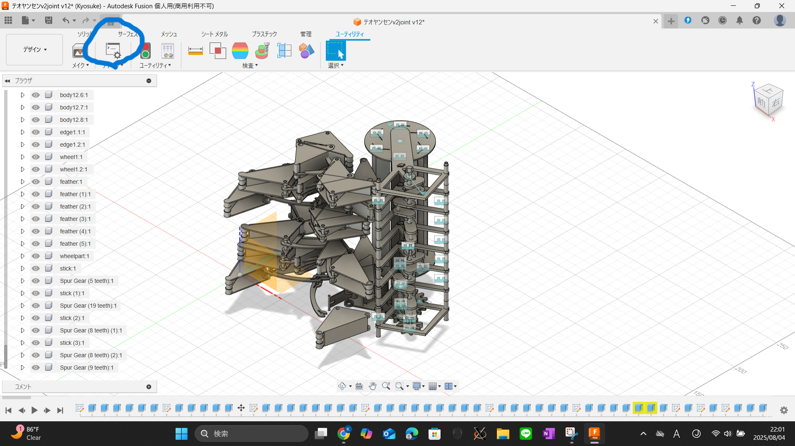
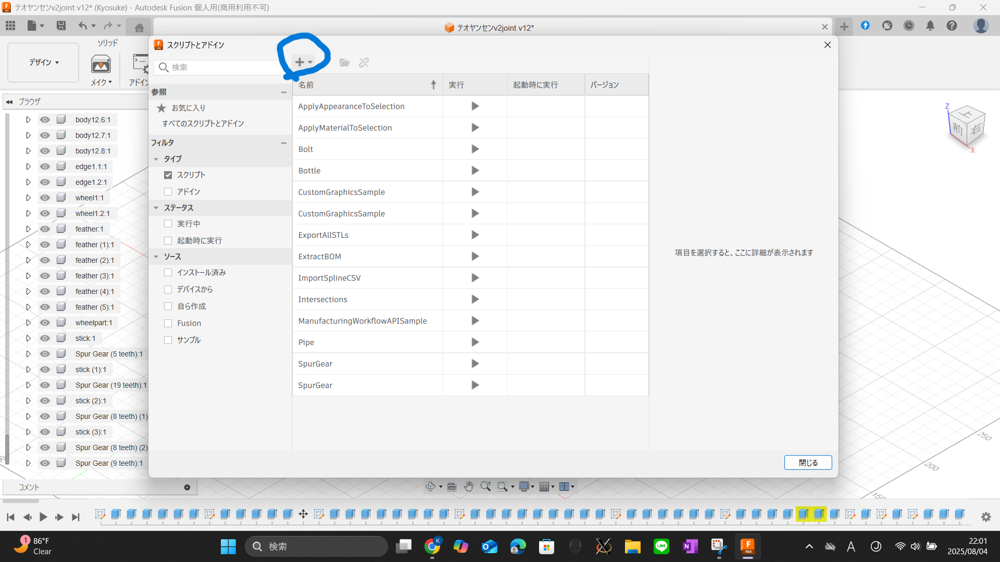
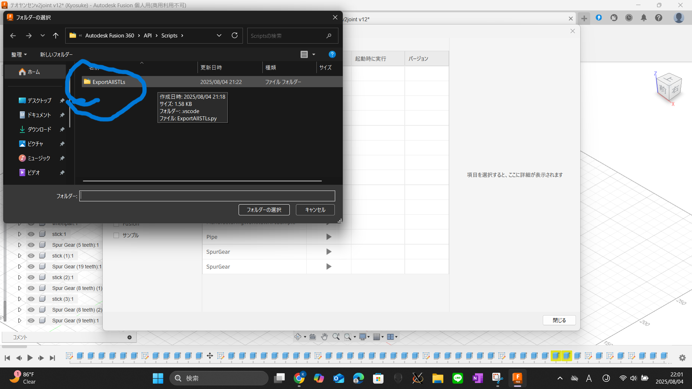

# Export All Components as STL – Fusion 360 スクリプト（日本語）

EN: English version → [README.md](./README.md)

このPythonスクリプトは、Autodesk Fusion 360上で **現在のデザイン内のすべてのコンポーネントを個別のSTLファイルとして自動でエクスポート**します。

> 💡 このアドインは、私のプロジェクトにおいて124個のコンポーネントを一つずつ手作業でSTL変換するのが非常に大変だったため作成しました。  
> ロボットメカニズムや機械系プロジェクトなど、部品が多い3Dプリント用途に最適です。

---

## ✅ 特長

- **すべてのコンポーネントとサブコンポーネント（Occurrence）**を自動で出力
- ファイル名はコンポーネント名に基づき自動命名
- **Fusion 360の「デザイン」ワークスペース**で使用可能
- Pythonベースで簡単にカスタマイズ可能
- Autodesk公式APIを使用したクリーンなコード

---

## 📁 フォルダ構成

```plaintext
fusion360-export-all-stl/
├── ExportAllSTLs.py      ← メインスクリプト
├── README.md             ← 英語ドキュメント
├── README_ja.md          ← この日本語ドキュメント
└── LICENSE               ← MITライセンス
```

---

## 🚀 Fusion 360 での使い方

### 1. Fusion 360 を開く  
ワークスペースを「**デザイン**」に設定しておきます。

### 2. スクリプトとアドインを開く  
`ユーティリティ` > `アドイン` > `スクリプトとアドイン` をクリック  


### 3. スクリプトを追加  
右上の `+` ボタンから「**自分のコンピュータから追加**」を選択し、`ExportAllSTLs` フォルダを指定します  


### 4. スクリプトを実行  
`ExportAllSTLs` を選択し、▶︎ボタンで実行  
保存先フォルダのダイアログが表示され、すべてのコンポーネントがSTLとして出力されます  


---

## 🛠 必要環境

- Autodesk Fusion 360（インストール済み）
- Fusion 360のPython API（Fusion内部で動作）
- 外部ツールは不要。**Fusionだけで完結します**

---

## 📄 ライセンス

このプロジェクトは [MIT License](LICENSE) のもとで提供されています。

---

## 🙋‍♂️ 貢献したい方へ

以下のような改善も歓迎しています：

- 他のファイル形式（STEP, IGESなど）の対応
- コンポーネントのフィルタリング
- タイムライン順のファイル名などの機能追加

プルリクエスト歓迎！

---

## 📷 スクリーンショット

| ステップ             | スクリーンショット                                 |
|----------------------|----------------------------------------------------|
| スクリプトパネルを開く |  |
| スクリプトを追加      |                 |
| スクリプト実行        |    |

---

## 📬 お問い合わせ

役に立ったと思ったら、ぜひ GitHub リポジトリにスターをお願いします ⭐  
不具合・改善案などは Issue からお気軽にどうぞ！
